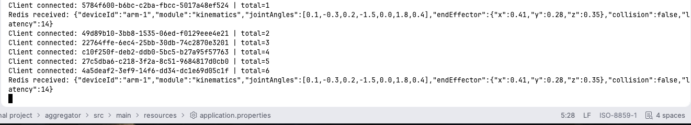

# Robo — Distributed Robot Parameter Pipeline with VLA Inference

CS6650 Final Project · Northeastern University

Team: Carolina Li · Wenxuan Nie · Zhongjie Ren · Zhongyi Shi

Advisor: Prof. Vishal Rajpal

---

## Overview

Robo is a distributed system for real-time robotic arm control and VLA (Vision-Language-Action) inference. Action commands are queued via AWS SQS, consumed by a Spring Boot worker that forwards them to an NVIDIA Isaac Sim instance running a Franka Panda arm, and simulation results are streamed to a React + Three.js frontend via WebSocket.

The VLA inference layer runs OpenVLA-7b on an AWS EC2 GPU instance, taking live camera frames from Isaac Sim and producing 7-DOF joint angle commands. An instruction-level Redis cache reduces repeated inference latency by 99.1%.

The core distributed systems design decision is **SQS as a decoupling layer** — multiple concurrent users can enqueue commands simultaneously without blocking each other or the simulation worker. The number of active WebSocket sessions corresponds directly to the number of concurrent users the system supports.

---

## Architecture

```
curl / frontend
    |
    | POST /infer (language instruction)
    ↓
EC2 g4dn.xlarge (OpenVLA inference)
    |── Redis cache check (localhost:6379)
    |   ├── HIT  → return cached joint angles (~19ms)
    |   └── MISS → run OpenVLA inference (~1000–2300ms) → write to cache
    |
    | joint angles → SQS
    ↓
Client (React + Three.js)
    |                       ↑
    | HTTP POST (action)    | WebSocket (receive-only)
    ↓                       |
AWS SQS              WebSocket Aggregator (port 8082)
(roboparam-queue)           ↑
    |                Redis pub/sub
    |               (roboparam:results)
    ↓                       ↑
worker3 (port 8083) ────────┘
    |
    | REST POST
    ↓
Isaac Sim @ 192.168.1.3
    ├── sim_state.py  — port 8011 — arm control + block actions
    └── sim_camera.py — port 8012 — live JPEG camera feed
```

**Critical design points:**

- The **client WebSocket is receive-only** — results are pushed from the aggregator to clients. Clients never publish through WebSocket.
- All **commands flow outbound via SQS only** — the client sends an HTTP POST which enqueues to SQS, never directly to worker3 or Isaac Sim.
- **worker3 is the only SQS consumer** — it polls, forwards to Isaac Sim via REST, then publishes the result to Redis.
- **Redis is used as pub/sub only** on the Mac side — not as a key-value store or database. There is no read operation to query. Messages are pushed to subscribers on arrival and do not persist.
- **Redis on EC2** is used as an inference cache only — keyed by instruction string, stores joint angle results from OpenVLA.
- The **aggregator subscribes to Redis** and fans results out to all connected WebSocket sessions simultaneously — O(1) work per update regardless of client count.
- **Registration service** runs on port `8084` and manages lab/device metadata in memory — it is separate from the simulation pipeline and not related to Redis.
- **Isaac Sim runs two servers simultaneously** — `sim_state.py` (port 8011, arm control) and `sim_camera.py` (port 8012, camera feed) — both as daemon threads in Script Editor.

---

## Message Flow

### Fixed action pipeline (demo)
```
Client → SQS → worker3 → Isaac Sim (port 8011) → worker3 → Redis → Aggregator → Client
```

### VLA inference pipeline
```
curl/frontend → EC2 /infer → Redis cache check
    ├── HIT  → SQS → worker3 → Isaac Sim → arm executes
    └── MISS → OpenVLA inference → Redis write → SQS → worker3 → Isaac Sim → arm executes
```

Step by step (fixed action):
1. Client sends an HTTP POST with `{"action": "push_red"}` which is enqueued to SQS
2. worker3 polls SQS (long-poll, 20s wait), deserializes the message
3. worker3 calls Isaac Sim REST endpoint — arm executes the action
4. Isaac Sim returns joint angles, end effector position, and collision status
5. worker3 publishes the result to Redis channel `roboparam:results`
6. Aggregator receives the Redis message and broadcasts to all connected WebSocket clients
7. All clients receive the update simultaneously via their receive-only WebSocket connection

---

## Services

| Service | Port | Description | Status |
|---|---|---|---|
| `worker3` | `8083` | Spring Boot SQS worker — polls action commands, calls Isaac Sim REST, publishes results to Redis | ✅ Running |
| `aggregator` | `8082` | Spring Boot WebSocket aggregator — subscribes to Redis pub/sub, fans out to all frontend clients | ✅ Running |
| `frontend` | `3000` | React + Three.js 3D URDF visualization of Franka Panda arm | ✅ Running |
| `registration-service` | `8084` | Manages lab and device metadata in memory — validates device existence for worker3 | ✅ Running |
| `vla_inference.py` | `8090` | OpenVLA inference server on EC2 — produces 7-DOF joint angles from live Isaac Sim camera feed | ✅ Running — see [`/vla`](./vla) |
| `vla_inference_cached.py` | `8090` | OpenVLA inference server with Redis instruction-level caching — 99.1% latency reduction on repeated instructions | ✅ Running — see [`/vla`](./vla) |
| Isaac Sim `sim_state.py` | `8011` | NVIDIA Isaac Sim — Franka Panda arm control + block actions (Windows, RTX 5090) | ✅ Running — see [`/isaac-sim`](./isaac-sim) |
| Isaac Sim `sim_camera.py` | `8012` | NVIDIA Isaac Sim — live JPEG camera feed for VLA inference | ✅ Running — see [`/isaac-sim`](./isaac-sim) |

---

## Stack

- **Backend:** Java 17, Spring Boot 3.2, AWS SDK v2
- **Queue:** AWS SQS (long-poll, Standard queue)
- **Pub/Sub:** Redis 7 (Docker, Mac) — pub/sub only, not used as a database
- **Inference Cache:** Redis (conda, EC2) — instruction-level cache for OpenVLA results
- **Simulation:** NVIDIA Isaac Sim 5.1 (Windows, RTX 5090) — see [`/isaac-sim`](./isaac-sim)
- **VLA Model:** OpenVLA-7b (HuggingFace) — 7-DOF joint angle inference from live camera feed
- **Inference Compute:** AWS EC2 g4dn.xlarge (T4 GPU, 16GB VRAM)
- **Frontend:** React, Three.js
- **Cloud:** AWS (SQS, EC2, us-east-1)

---

## Distributed Systems Design

### Why SQS over direct REST calls?
Direct REST from client → Isaac Sim would block — one slow client blocks all others. SQS decouples producers from the consumer entirely. Any number of clients can enqueue simultaneously without coordination, and worker3 drains the queue at its own pace. This is the core distributed coordination story and the key design decision of the system.

### Why Redis pub/sub over polling?
Polling the aggregator for new results would introduce latency and unnecessary load on Redis. Pub/sub pushes results to the aggregator the instant worker3 publishes — no polling delay, no wasted queries.

### Why Redis cache on EC2 for VLA inference?
OpenVLA inference costs ~1000–2300ms per request. In a demo or classroom setting, the same 2–3 instructions are sent repeatedly. Caching results by instruction string on the same EC2 instance as the inference service gives ~1ms cache lookup latency (localhost), reducing repeat request latency to ~19ms — a 99.1% reduction. A shared Redis cache also supports horizontal scaling: multiple inference instances share the same cache, eliminating redundant GPU compute across replicas.

### Scalability
- **worker3 is stateless** — multiple instances can poll the same SQS queue concurrently; visibility timeout (30s) prevents duplicate processing. Measured: 3 instances → 329.3 req/sec throughput (↑ ~3x vs single instance at 110.6 req/sec), max latency maintained at ~128ms
- **SQS as backpressure** — absorbs command bursts from concurrent users without overwhelming Isaac Sim; queue depth grows under load and drains as worker3 processes
- **Redis pub/sub decoupling** — worker3 and aggregator are fully independent; either can be restarted without affecting the other
- **Aggregator fan-out** — a single sim result is broadcast to N connected clients simultaneously via concurrent thread pool (`ExecutorService`); slow clients do not block others. Verified with 6 simultaneous WebSocket clients receiving broadcasts concurrently
- **VLA inference cache** — repeated instructions bypass GPU inference entirely; supports horizontal scaling of inference instances via shared cache

### Fault Tolerance
- **At-least-once delivery** — worker3 only deletes an SQS message after a successful Isaac Sim response; on failure, the message becomes visible again after the 30s visibility timeout and is retried automatically
- **Isaac Sim isolation** — worker3 handles Isaac Sim connection errors gracefully without crashing; failed messages are logged and retried via SQS visibility timeout
- **Client disconnect tolerance** — aggregator removes stale WebSocket sessions on disconnect; remaining clients are unaffected
- **Isaac Sim dual-server isolation** — `sim_state.py` and `sim_camera.py` run as independent daemon threads; a crash in the camera server does not affect arm control

### Consistency
- Commands are serialized through SQS — if multiple users send commands simultaneously, they are processed in arrival order by worker3
- Frontend receives **eventual consistency** — clients see the latest arm state within ~200ms; acceptable for visualization use case
- **Last write wins at Isaac Sim** — concurrent commands from multiple users are queued and applied sequentially; the arm reflects the most recently processed command

### Latency
- SQS long-poll (`waitTimeSeconds=20`) eliminates busy-waiting. Measured: max latency ↓ 69% (131ms → 41ms), std deviation ↓ 65% (4.19 → 1.46), throughput maintained at ~110 req/sec
- Measured end-to-end latency: **~33–69ms** (SQS receive → Isaac Sim response → Redis publish)
- VLA inference latency: **~963–2289ms** (cache miss, full GPU inference) / **~19ms** (cache hit, Redis lookup)

---

## Architecture FAQ

**Why not have the client send commands directly to worker3 via REST?**
That would couple the client to a single worker instance. If worker3 is slow or busy processing a command, the next client would block waiting for a response. SQS absorbs the burst — any number of clients can enqueue without waiting, and worker3 drains the queue independently.

**Why not use WebSocket for both sending commands and receiving results?**
WebSocket is bidirectional but stateful — maintaining send channels for every client adds complexity and a potential bottleneck at the aggregator. Separating concerns keeps the design clean: SQS handles durable, decoupled command delivery; WebSocket handles lightweight real-time fan-out to clients.

**What happens if worker3 goes down?**
Messages stay in SQS until the visibility timeout expires (30s), then become visible again for reprocessing. No messages are lost. When worker3 restarts, it resumes polling and drains the backlog.

**What happens if Isaac Sim goes down?**
worker3 catches the connection error, logs it, and does not delete the SQS message. The message retries after 30s. The rest of the system (aggregator, frontend, Redis) continues running unaffected.

**What happens if a client disconnects?**
The aggregator removes the stale WebSocket session on disconnect. All other connected clients continue receiving updates normally.

**How many concurrent users can the system handle?**
SQS and Redis pub/sub are effectively unbounded for this scale. The practical bottleneck is worker3 — a single poller processing one command at a time. Multiple worker3 instances can be added to increase throughput; SQS visibility timeout prevents duplicate processing. The stress test measures this curve directly.

**Why Standard SQS queue and not FIFO?**
Standard queue gives higher throughput and is sufficient for the current demo scope where actions are discrete and non-overlapping. FIFO guarantees strict ordering which matters when joint commands must be applied in exact sequence — that's a planned future optimization.

**Is Redis a database in this system?**
No. On the Mac, Redis is used exclusively as a pub/sub message broker on channel `roboparam:results`. On EC2, Redis is used exclusively as an inference result cache keyed by instruction string. Neither instance uses Redis as a key-value store or database. The registration service uses an in-memory store (Java `LinkedHashMap`) — also not Redis.

**Why run two Isaac Sim servers simultaneously?**
`sim_state.py` owns arm control and block actions (port 8011). `sim_camera.py` owns the live camera feed for VLA inference (port 8012). Separating them means a camera server restart never disrupts arm control, and the VLA pipeline can be started/stopped independently of the demo action pipeline.

---

## Running the System

### Prerequisites

- Java 17+, Maven
- Docker (for Redis on Mac)
- AWS credentials configured (`aws configure`)
- Node.js 18+ (for frontend)
- Isaac Sim running on Windows machine — see [`/isaac-sim/README.md`](./isaac-sim)
- EC2 g4dn.xlarge running with OpenVLA-7b and Redis — see [`/vla/VLA_EC2_SETUP.md`](./vla/VLA_EC2_SETUP.md)

### 1. Start Redis (Mac — pub/sub)

```bash
docker run -d -p 6379:6379 redis:7
```

### 2. Configure AWS Credentials

#### Option A — AWS Academy (session-based)

Each time your AWS Academy lab session restarts, update credentials:

```bash
cat > ~/.aws/credentials << 'EOF'
[default]
aws_access_key_id=<your_key_id>
aws_secret_access_key=<your_secret>
aws_session_token=<your_session_token>
EOF
aws configure set region us-east-1
```

#### Option B — Personal AWS Account (permanent credentials)

No session token needed. One-time setup:

```bash
aws configure
# AWS Access Key ID: <your_access_key_id>
# AWS Secret Access Key: <your_secret_access_key>
# Default region name: us-east-1
# Default output format: json
```

This writes to `~/.aws/credentials` and `~/.aws/config` permanently — no need to update between sessions.

**IAM setup for personal account:**

1. Go to AWS Console → IAM → Users → Create user
2. Name the user (e.g. `snapgrid-worker`), disable console access
3. Attach the following policies directly:
   - `AmazonSQSFullAccess` — required for worker3 to poll and delete SQS messages
   - `AmazonEC2FullAccess` — required if deploying to EC2
   - `ServiceQuotasFullAccess` — optional, for quota monitoring
4. Go to Security credentials → Create access key → select "Local code"
5. Copy the Access Key ID and Secret Access Key into `aws configure`

**Minimum required SQS permissions** (if you prefer a least-privilege custom policy instead of `AmazonSQSFullAccess`):

```json
{
  "Version": "2012-10-17",
  "Statement": [
    {
      "Effect": "Allow",
      "Action": [
        "sqs:ReceiveMessage",
        "sqs:DeleteMessage",
        "sqs:SendMessage",
        "sqs:GetQueueAttributes",
        "sqs:GetQueueUrl"
      ],
      "Resource": "arn:aws:sqs:us-east-1:826889494728:roboparam-queue"
    }
  ]
}
```


Verify either option:
```bash
aws sqs list-queues
```

### Cross-Account SQS Access

If a team member is using a **different AWS account** and needs to access `roboparam-queue`, a resource-based policy must be added to the queue granting their IAM user explicit access.

Go to AWS Console → SQS → `roboparam-queue` → Edit → Access policy, and add a statement for their IAM user ARN:

```json
{
  "Version": "2012-10-17",
  "Statement": [
    {
      "Effect": "Allow",
      "Principal": {
        "AWS": "arn:aws:iam::<their-account-id>:user/<their-username>"
      },
      "Action": [
        "sqs:ReceiveMessage",
        "sqs:DeleteMessage",
        "sqs:SendMessage",
        "sqs:GetQueueAttributes"
      ],
      "Resource": "arn:aws:sqs:us-east-1:179895363911:roboparam-queue"
    }
  ]
}
```

Their IAM user must also have `AmazonSQSFullAccess` (or equivalent) attached on their own account side. Both the queue policy and the user policy must allow access for cross-account calls to succeed.


---

Edit `worker3/src/main/resources/application.yml` if needed:

```yaml
worker:
  sqs-queue-url: https://sqs.us-east-1.amazonaws.com/826889494728/roboparam-queue
  isaac-sim-base-url: http://192.168.1.3:8011
  isaac-sim-mock: false   # set to true for local stress testing without Isaac Sim — do not commit
```

```bash
cd worker3
mvn spring-boot:run
```

worker3 starts on port `8083` and begins polling SQS immediately.

### 4. Run aggregator

```bash
cd aggregator
mvn spring-boot:run
```

Aggregator starts on port `8082`, subscribes to Redis channel `roboparam:results`, and accepts WebSocket connections at `ws://localhost:8082/ws`.

### 5. Run frontend

```bash
cd frontend
npm install
npm start
```

Frontend starts on port `3000`.

### 6. Start Isaac Sim (Windows)

1. Open Isaac Sim, load `roboparam_scene.usd`
2. In Script Editor, run `sim_state.py` — wait for "Robo endpoint ready"
3. Open a new Script Editor tab, run `sim_camera.py` — wait for "[sim_camera] Camera server running"
4. Hit **Play**

Both servers must be running and Isaac Sim must be in Play mode before sending VLA inference requests.

### 7. Start VLA inference (EC2)

See [`/vla/VLA_EC2_SETUP.md`](./vla/VLA_EC2_SETUP.md) for full EC2 setup.

```bash
# Start EC2
aws ec2 start-instances --instance-ids i-0e08e1a63fc48056e --region us-east-1

# Get current public IP
aws ec2 describe-instances \
  --instance-ids i-0e08e1a63fc48056e \
  --query "Reservations[0].Instances[0].PublicIpAddress" \
  --region us-east-1 --output text

# SSH in
ssh -i ~/CS6650/openvla-key.pem ec2-user@<public-ip>

# On EC2 — start Redis and inference service
redis-server --daemonize yes
conda activate openvla
export PYTORCH_CUDA_ALLOC_CONF=expandable_segments:True
python vla_inference_cached.py
```

Test from Mac:
```bash
curl -X POST http://<ec2-public-ip>:8090/infer \
  -H "Content-Type: application/json" \
  -d '{"instruction": "push the red block forward"}'
```

**Stop EC2 when done to avoid charges:**
```bash
aws ec2 stop-instances --instance-ids i-0e08e1a63fc48056e --region us-east-1
```

---

## Testing

### Send a test action command via SQS

```bash
aws sqs send-message \
  --queue-url https://sqs.us-east-1.amazonaws.com/826889494728/roboparam-queue \
  --message-body '{"action": "push_red"}'
```

Valid actions: `push_red`, `push_green`, `reset`

### Expected worker3 log

```
INFO  worker3.IsaacSimClient : → Isaac Sim action=push_red
INFO  worker3.IsaacSimClient : ← Isaac Sim status=200 OK
INFO  worker3.SqsPoller      : Published to Redis: deviceId=arm-1 latency=50ms
```

### Expected aggregator log

```
Redis received: {"deviceId":"arm-1","module":"kinematics","jointAngles":[...],"endEffector":{"x":0.1071,"y":0.0005,"z":0.9277},"collision":false,"latency":50}
```

---

## Payload Schema

Full result payload published to Redis channel `roboparam:results` and broadcast over WebSocket to all connected clients:

```json
{
  "deviceId":    "arm-1",
  "module":      "kinematics",
  "jointAngles": [0.1, -0.3, 0.0, -1.5, 0.0, 1.8, 0.7],
  "endEffector": { "x": 0.1071, "y": 0.0005, "z": 0.9277 },
  "collision":   false,
  "latency":     50
}
```

VLA inference response (`/infer`):

```json
{
  "status": "ok",
  "cache": "hit",
  "instruction": "push the red block forward",
  "joint_angles": [-0.005, -1.762, 0.0, -3.071, 0.012, 1.180, 2.897],
  "latency_ms": 19.27
}
```

---

## SQS Queue

| Property | Value |
|---|---|
| Queue name | `roboparam-queue` |
| Type | Standard (at-least-once delivery) |
| URL | `https://sqs.us-east-1.amazonaws.com/826889494728/roboparam-queue` |
| Region | `us-east-1` |
| Visibility timeout | 30s |
| Receive wait time | 20s (long-poll) |

---

## Local Development Without Isaac Sim

For stress testing or local development when Isaac Sim is not available, worker3 supports a mock mode that returns a hardcoded response instead of calling Isaac Sim.

Add to your **local** `application.yml` only — **do not commit this**:

```yaml
worker:
  isaac-sim-mock: true
```

With this flag, the full pipeline `SQS → worker3 → Redis → aggregator → WebSocket` runs locally with no dependency on Isaac Sim or any GPU. This is used for concurrent load testing (K threads → K SQS sends → K WebSocket connections).

---

## End-to-End Test Results

Full pipeline verified: **SQS → worker3 → Isaac Sim → Redis → aggregator → WebSocket → frontend**

| Test | Result |
|---|---|
| SQS queue creation | ✅ `roboparam-queue` live in `us-east-1` |
| worker3 startup | ✅ Started on port 8083 |
| SQS message ingestion | ✅ Message received and deserialized correctly |
| Isaac Sim reachability | ✅ Mac → Windows @ 192.168.1.3:8011 |
| Isaac Sim joint application | ✅ All 7 joints applied with correct values |
| Isaac Sim end effector | ✅ `endEffector` x/y/z returned in response |
| worker3 → Redis publish | ✅ Result published to `roboparam:results` |
| Aggregator Redis subscribe | ✅ Full payload received by aggregator |
| Aggregator → WebSocket | ✅ Payload pushed to connected clients |
| Full pipeline | ✅ SQS → worker3 → Isaac Sim → Redis → aggregator → WebSocket |
| Isaac Sim camera endpoint | ✅ `sim_camera.py` serving JPEG frames at port 8012 |
| VLA end-to-end | ✅ curl → EC2 /infer → Isaac Sim /camera → OpenVLA → SQS → worker3 → Isaac Sim |
| VLA cache miss | ✅ Full inference latency: ~963–2289ms |
| VLA cache hit | ✅ Redis cache hit latency: ~19ms (99.1% reduction) |
| SQS long-poll optimization | ✅ Max latency ↓ 69% (131ms → 41ms), std deviation ↓ 65% |
| Horizontal scaling (3x worker3) | ✅ Throughput ↑ ~3x (110.6 → 329.3 req/sec), latency maintained |
| Concurrent WebSocket broadcast | ✅ 6 simultaneous clients received broadcast concurrently with no blocking |

### SQS Long-Polling — Before vs. After

**Baseline (short-poll):**


**Optimized (long-poll):**


### Horizontal Scaling — 3x worker3 Instances


### Concurrent WebSocket Broadcast — 6 Clients



### Isaac Sim — Action Execution (push_red / push_green / reset)

Direct REST calls to the Isaac Sim action endpoint returning HTTP 200 with all 7 joint values.


### Full Pipeline — SQS to Frontend

SQS messages sent from Mac terminal, worker3 consuming and forwarding to Isaac Sim (latency ~33–69ms), results published to Redis, aggregator broadcasting to the React dashboard via WebSocket. Browser DevTools shows live WebSocket payload.


### VLA Inference — Cache Miss and Hit

First request runs full OpenVLA GPU inference (cache miss, ~2172ms). Second identical request served from Redis cache (cache hit, ~19ms).


---

## Stress Testing

Three scripts covering different pipeline segments — see [`/stress-test/README.md`](./stress-test/README.md) for full usage, options, and sample output.

| Script | What it tests |
|---|---|
| `stress_test.py` | Aggregator broadcast capacity — injects directly into Redis, bypasses SQS and worker3 |
| `vla_stress_test.py` | SQS + worker3 throughput — publishes joint angle commands directly to SQS |
| `e2e_client.py` | Full round-trip latency — each simulated user has its own WebSocket connection and SQS sender |

---

## Future Optimizations

| Optimization | Description | Expected Impact |
|---|---|---|
| OpenVLA inference caching | ✅ Implemented — Redis instruction-level cache on EC2. Cache miss: 2172ms → Cache hit: 19ms | 99.1% latency reduction on repeated instructions |
| Redis Cluster | Replace single Redis pub/sub node with a cluster to eliminate SPOF and support higher message volumes | Eliminates Redis as single point of failure; enables sub-ms pub/sub at scale |
| SQS FIFO Queue | Replace Standard queue with FIFO to guarantee strict joint command ordering | Deterministic robot motion under concurrent multi-user load |