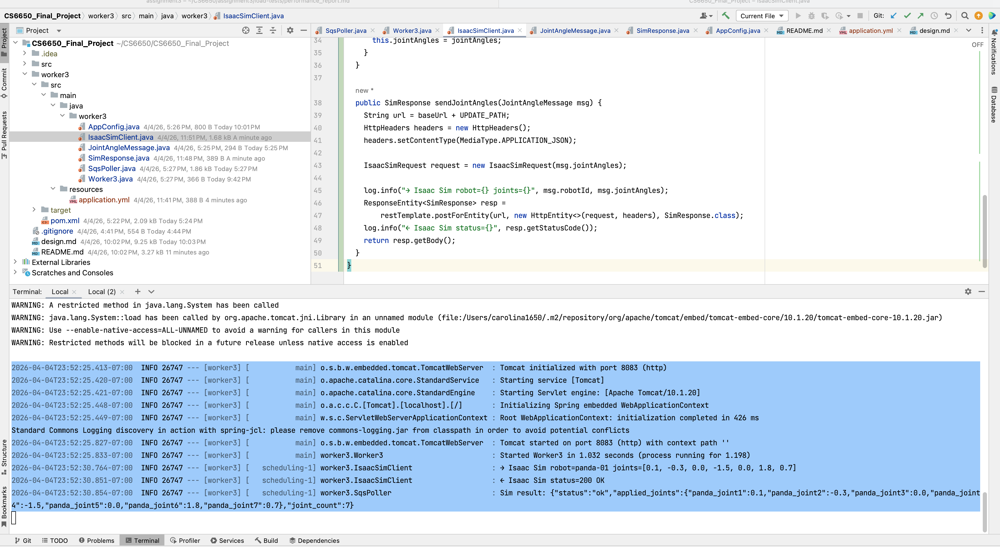

# SnapGrid — System Design

CS6650 Final Project · Northeastern University

Team: Carolina Li · Wenxuan Nie · Zhongjie Ren · Zhongyi Shi

Advisor: Prof. Vishal Rajpal

---

## 1. Overview

SnapGrid is a distributed VLA (Vision-Language-Action) training and visualization platform for collaborative robotic LEGO assembly. Multiple students can simultaneously observe and interact with a Franka Panda arm executing LEGO assembly tasks inside NVIDIA Isaac Sim. A pretrained VLA model (OpenVLA) receives natural language instructions and outputs joint angle commands, which flow through an AWS SQS-backed worker pipeline to Isaac Sim. All connected students see the robot's joint state update in real time via WebSocket.

---

## 2. Use Case — Multi-Student Collaborative Assembly

Multiple students work together on the same LEGO assembly task:

1. A student issues a natural language instruction: *"place the 2x4 red brick on top of the blue base"*
2. OpenVLA processes the instruction and outputs 7-DOF joint angle commands
3. Commands are enqueued to SQS and picked up by worker3
4. worker3 forwards the commands to Isaac Sim — the Panda arm executes the motion
5. The simulation state is streamed via WebSocket to **all connected students** simultaneously
6. Every student's browser shows the arm moving in real time in 3D

---

## 3. System Architecture

```
┌──────────────────────────────────────────────────────────────────────┐
│                          CLIENT LAYER                                │
│   Student A (Browser)   Student B (Browser)   Student C (Browser)   │
│   React + Three.js      React + Three.js       React + Three.js     │
└───────────────┬─────────────────┬──────────────────┬────────────────┘
                │ WebSocket        │ WebSocket         │ WebSocket
┌───────────────▼─────────────────▼──────────────────▼────────────────┐
│                       AGGREGATOR LAYER                               │
│              WebSocket Aggregator (Spring Boot, port 8080)           │
│         Fan-out: broadcasts sim state to all connected clients       │
│         Lab Registry · Device Registry · Session Management          │
└────────────────────────────┬─────────────────────────────────────────┘
                             │ HTTP POST (sim result)
┌────────────────────────────▼─────────────────────────────────────────┐
│                        WORKER LAYER                                  │
│        worker3 (Spring Boot, port 8083) — ✅ Verified working        │
│        SQS poll → Isaac Sim REST → POST result to aggregator         │
│        Stateless · Horizontally scalable                             │
└───────────┬────────────────────────────────────────┬─────────────────┘
            │ SQS consume                             │ REST POST
┌───────────▼──────────────┐          ┌──────────────▼─────────────────┐
│      AWS SQS             │          │   NVIDIA Isaac Sim 5.x          │
│   roboparam-queue        │          │   192.168.1.3:8011              │
│   us-east-1 · Standard   │          │   Franka Panda · LEGO scene     │
│   ✅ Verified working     │          │   Windows · RTX 5090            │
└───────────▲──────────────┘          │   ✅ Verified working            │
            │ SQS publish             └─────────────────────────────────┘
┌───────────┴──────────────────────────────────────────────────────────┐
│                       VLA INFERENCE LAYER                            │
│   OpenVLA (HuggingFace) — pretrained on robot manipulation tasks     │
│   Input: natural language instruction + camera observation           │
│   Output: 7-DOF joint angle commands → enqueued to SQS              │
└──────────────────────────────────────────────────────────────────────┘
```

### Component Responsibilities

| Component | Responsibility | Status |
|---|---|---|
| **OpenVLA** | Pretrained VLA model; takes language instruction + camera obs; outputs joint angles | 🔲 Integration planned |
| **Isaac Sim** | Runs Franka Panda in LEGO assembly scene; accepts joint commands via REST | ✅ Running @ 192.168.1.3:8011 |
| **worker3** | Polls SQS; forwards joint angles to Isaac Sim; pushes result to aggregator | ✅ Running @ port 8083 |
| **WebSocket Aggregator** | Fans out sim state to all connected student browsers; holds lab/device registry | 🔲 In progress |
| **Frontend** | React + Three.js 3D URDF visualization; multiple concurrent student sessions | 🔲 In progress |

---

## 4. API Contracts

### 4.1 SQS Queue

| Property | Value |
|---|---|
| Queue name | `roboparam-queue` |
| Type | Standard (at-least-once) |
| URL | `https://sqs.us-east-1.amazonaws.com/826889494728/roboparam-queue` |
| Region | `us-east-1` |
| Visibility timeout | 30s |
| Receive wait time | 20s (long-poll) |

### 4.2 SQS Message — Joint Angle Command

```json
{
  "robotId": "panda-01",
  "jointAngles": [0.1, -0.3, 0.0, -1.5, 0.0, 1.8, 0.7],
  "timestamp": 1712345678901
}
```

| Field | Type | Description |
|---|---|---|
| `robotId` | `string` | Unique robot instance identifier |
| `jointAngles` | `double[7]` | 7-DOF Franka Panda joint positions (radians) |
| `timestamp` | `long` | Unix ms timestamp of the command |

### 4.3 Isaac Sim REST Endpoint

**`POST /roboparam/roboparam/update`**
Base URL: `http://192.168.1.3:8011`
Swagger: `http://192.168.1.3:8011/docs`

Request:
```json
{ "joint_angles": [0.1, -0.3, 0.0, -1.5, 0.0, 1.8, 0.7] }
```

Response:
```json
{
  "status": "ok",
  "applied_joints": {
    "panda_joint1": 0.1,
    "panda_joint2": -0.3,
    "panda_joint3": 0.0,
    "panda_joint4": -1.5,
    "panda_joint5": 0.0,
    "panda_joint6": 1.8,
    "panda_joint7": 0.7
  },
  "joint_count": 7
}
```

### 4.4 worker3 → Aggregator Push

**`POST /aggregate/update`** (aggregator REST endpoint)

```json
{
  "robotId": "panda-01",
  "appliedJoints": { "panda_joint1": 0.1, "panda_joint2": -0.3, "...": "..." },
  "jointCount": 7,
  "timestamp": 1712345678950
}
```

### 4.5 WebSocket Events

**Server → All Clients** (aggregator fans out to every connected student)

```json
{
  "event": "sim_update",
  "robotId": "panda-01",
  "appliedJoints": { "panda_joint1": 0.1, "panda_joint2": -0.3, "...": "..." },
  "timestamp": 1712345678950
}
```

**Client → Server** (student sends a language instruction)

```json
{
  "event": "instruction",
  "studentId": "student-a",
  "instruction": "place the 2x4 red brick on top of the blue base"
}
```

---

## 5. VLA Pipeline

### Model: OpenVLA
- Pretrained on robot manipulation tasks, available on HuggingFace
- Input: natural language instruction + camera observation from Isaac Sim
- Output: 7-DOF joint angle sequence for the Franka Panda arm
- Alternative: **Octo** (Berkeley) for lighter inference footprint

### Inference Flow

```
Student instruction (text)
        +
Isaac Sim camera observation (image)
        ↓
   OpenVLA inference (HuggingFace)
        ↓
  Joint angle sequence
        ↓
   SQS roboparam-queue
        ↓
     worker3
        ↓
   Isaac Sim @ 8011
        ↓
  Sim state → Aggregator → All student browsers
```

### Sim-to-Real Validation
- Policies are evaluated by comparing sim joint trajectories against reference LEGO assembly trajectories
- Isaac Sim's rigid body + contact dynamics minimizes the sim-to-real gap for contact-rich assembly tasks

---

## 6. Distributed Systems Design

### 6.1 Scalability
- **worker3 is stateless** — multiple instances can poll the same SQS queue concurrently; visibility timeout prevents duplicate processing
- **SQS as backpressure** — absorbs joint command bursts from VLA inference or multiple students without overwhelming Isaac Sim
- **Aggregator fan-out** — a single sim state update is broadcast to N connected student browsers; O(1) work per update regardless of student count
- **Horizontal scaling** — aggregator instances scale behind a load balancer with WebSocket session affinity

### 6.2 Fault Tolerance
- **At-least-once delivery** — worker3 deletes SQS messages only after successful Isaac Sim response; failures retry after 30s visibility timeout ✅ verified
- **Isaac Sim isolation** — single GPU node; worker3 handles connection errors gracefully without crashing
- **Student disconnect tolerance** — aggregator removes stale WebSocket sessions on disconnect; remaining students unaffected

### 6.3 Consistency
- Joint commands are processed in arrival order per SQS queue
- **Concurrent student commands** — if multiple students send instructions simultaneously, commands are serialized through SQS; last write wins at Isaac Sim
- Frontend receives eventual consistency — acceptable for visualization; students see the latest arm state within ~200ms

### 6.4 Latency
- SQS long-poll (`waitTimeSeconds=20`) eliminates busy-waiting
- Target end-to-end latency: **< 200ms** from SQS enqueue to WebSocket push
- VLA inference latency (~100-500ms) runs asynchronously and is excluded from the real-time visualization budget

---

## 7. Verified Test Results

| Test | Result |
|---|---|
| SQS queue creation | ✅ `roboparam-queue` live in `us-east-1` |
| AWS credentials | ✅ Verified via `aws sqs list-queues` |
| worker3 startup | ✅ Started in ~1s on port 8083 |
| SQS message ingestion | ✅ Message received and deserialized correctly |
| Isaac Sim reachability | ✅ Mac → Windows @ 192.168.1.3:8011 verified |
| Isaac Sim joint application | ✅ All 7 joints applied with correct values |
| Full pipeline | ✅ SQS → worker3 → Isaac Sim → 200 OK → correct joint values |

