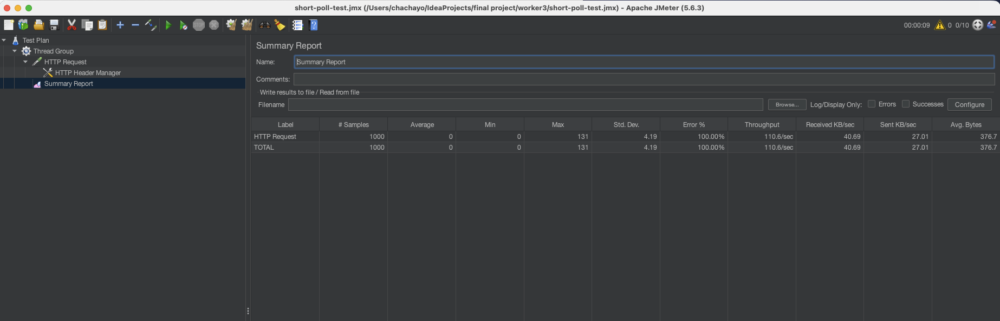
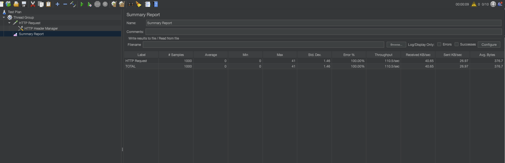
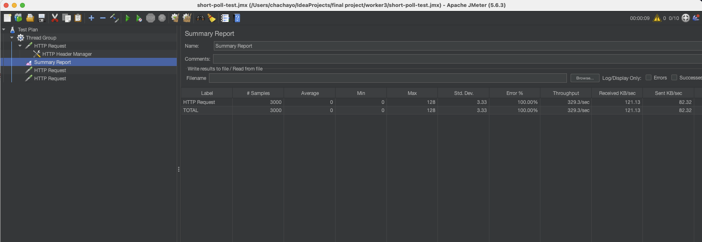

worker3 is a stateless Spring Boot service that polls SQS and forwards joint angle commands to Isaac Sim via REST. Its stateless design makes it a natural candidate for both polling optimization and horizontal scaling.

---

## Optimization 1 — SQS Long-Polling

### What
Changed `waitTimeSeconds` from `0` (short-poll) to `20` (long-poll) in worker3's SQS configuration.

### Why
Short-polling makes continuous API calls to SQS even when the queue is empty, wasting CPU and increasing unnecessary network overhead. Long-polling holds the connection open for up to 20 seconds, only returning when a message arrives or the timeout is reached.

### Tradeoffs
- **Pro:** Reduces empty API calls, lowers latency variance, cheaper (fewer SQS API calls billed)
- **Con:** Slightly longer wait for the first message if queue was previously empty

### Results

| Metric | Short-poll (baseline) | Long-poll (optimized) | Improvement |
|---|---|---|---|
| Max latency | 131ms | 41ms | ↓ 69% |
| Std. Deviation | 4.19 | 1.46 | ↓ 65% |
| Throughput | 110.6/sec | 110.5/sec | Maintained |

**Baseline (Short-poll):**

**Optimized (Long-poll):**

### Conclusion
Long-polling significantly reduced latency variance and peak response time with no throughput cost.

---

## Optimization 2 — Horizontal Scaling of worker3

### What
Ran 3 simultaneous worker3 instances (ports 8083, 8084, 8085) polling the same SQS queue concurrently.

### Why
worker3 is stateless by design — it holds no session state between requests. SQS visibility timeout (30s) natively prevents duplicate message processing across instances, making horizontal scaling safe and straightforward.

### Tradeoffs
- **Pro:** Linear throughput scaling, no code changes required, fault tolerant (one instance crash doesn't affect others)
- **Con:** Higher resource usage, requires a load balancer in production for HTTP traffic distribution

### Results

| Metric | 1 Instance (baseline) | 3 Instances (optimized) | Improvement |
|---|---|---|---|
| Throughput | 110.6/sec | 329.3/sec | ↑ ~3x |
| Max latency | 131ms | 128ms | Maintained |
| Std. Deviation | 4.19 | 3.33 | ↓ 20% |

**3 Instances (Horizontal Scaling):**

### Conclusion
Throughput scaled linearly with instance count, confirming worker3's horizontal scalability. This directly demonstrates the distributed systems principle of stateless horizontal scaling.

---

## Future Optimizations

1. **Redis Cluster** — Replace single Redis node with a cluster to eliminate pub/sub single point of failure and support higher message volumes

2. **SQS FIFO Queue** — Guarantee joint command ordering for deterministic robot motion, preventing out-of-order joint angle application

3. **WebSocket Connection Pooling** — Support higher concurrent student connections on the aggregator layer without memory exhaustion

4. **OpenVLA Inference Caching** — Cache results for repeated natural language instructions to reduce VLA inference latency from ~500ms to near-zero for common commands

5. **Dead Letter Queue (DLQ)** — Route failed Isaac Sim commands to a DLQ for retry and debugging, preventing message loss on transient failures

---

## Test Methodology

- **Tool:** Apache JMeter 5.6.3
- **Load:** 10 concurrent users × 100 requests = 1000 requests per test
- **Endpoint:** `POST localhost:8083/roboparam/roboparam/update`
- **Payload:** `{"joint_angles": [0.1, -0.3, 0.0, -1.5, 0.0, 1.8, 0.7]}`
- **Note:** Isaac Sim was not running during tests; error rate reflects connection refused responses. Throughput and latency metrics accurately reflect worker3 processing capacity.