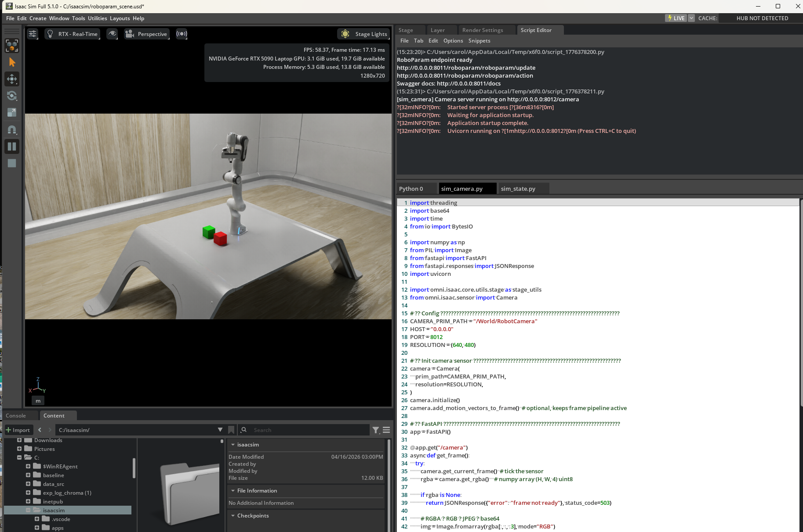
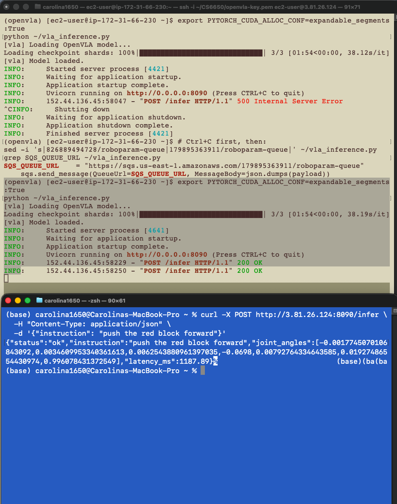

# VLA Inference — Setup & Deployment Guide

This document covers the full VLA inference pipeline for SnapGrid: running OpenVLA-7b on an AWS EC2 GPU instance, wired into the distributed SQS pipeline.

---

## Architecture

```
Isaac Sim (Windows, RTX 5090)
    ↓ sim_camera.py — port 8012 — /camera endpoint (JPEG frame)
EC2 g4dn.xlarge (T4 GPU, us-east-1)
    - pulls live camera frame via HTTP
    - runs OpenVLA-7b inference with language instruction
    - publishes 7-DOF joint angles → SQS roboparam-queue
    ↓
worker3 (Spring Boot, Mac, port 8083) → Isaac Sim REST (port 8011) → arm executes
    ↓
Redis pub/sub → aggregator (port 8082) → WebSocket → frontend
```

---

## VLA Strategy

**Model:** OpenVLA-7b pretrained (HuggingFace: `openvla/openvla-7b`)

**Approach:** Pretrained zero-shot inference. OpenVLA was trained on BridgeData V2 block-pushing demonstrations — directly analogous to the SnapGrid push scene. No fine-tuning required for the April 21 showcase.

**Future work:** Fine-tune on Isaac Sim demo trajectories (RLDS format) using LoRA on Northeastern Discovery cluster (A100-80GB already set up at `/projects/SuperResolutionData/CL-shadowRemoval-logChroma/vla-inference/openvla-7b`).

**Narrative framing:** *"OpenVLA is a pluggable, research-grade inference component sitting on top of our distributed infrastructure layer. The same SQS → worker3 → Isaac Sim pipeline works regardless of what model sits upstream."*

---

## AWS EC2 Instance

| Resource | Value |
|---|---|
| Instance ID | `i-0e08e1a63fc48056e` |
| Instance type | `g4dn.xlarge` (1x T4 GPU, 16GB VRAM, 4 vCPU) |
| AMI | `ami-098e39bafa7e7303d` (Amazon Linux 2023) |
| Region | `us-east-1f` |
| Public IP | `3.81.26.124` *(changes on restart — use describe-instances)* |
| Key pair | `openvla-key` → `~/CS6650/openvla-key.pem` |
| Security group | `sg-04e3d077c5be1f4fd` (openvla-sg) |
| Ports open | 22 (SSH), 8090 (inference endpoint) |
| Cost | ~$0.53/hr while running |

### SSH
```bash
ssh -i ~/CS6650/openvla-key.pem ec2-user@<public-ip>
```

### Get current public IP
```bash
aws ec2 describe-instances \
  --instance-ids i-0e08e1a63fc48056e \
  --query "Reservations[0].Instances[0].PublicIpAddress" \
  --region us-east-1 \
  --output text
```

### Stop instance when not in use (IMPORTANT — avoid charges)
```bash
aws ec2 stop-instances --instance-ids i-0e08e1a63fc48056e --region us-east-1
```

### Restart instance
```bash
aws ec2 start-instances --instance-ids i-0e08e1a63fc48056e --region us-east-1
```

---

## Environment Setup (run once on EC2)

```bash
# Accept conda ToS (required on Amazon Linux 2023)
conda tos accept --override-channels --channel https://repo.anaconda.com/pkgs/main
conda tos accept --override-channels --channel https://repo.anaconda.com/pkgs/r

# Install build tools
sudo yum install -y gcc gcc-c++ make

# Create env
conda create -n openvla python=3.10 -y
conda activate openvla

# Install dependencies
pip install torch torchvision --index-url https://download.pytorch.org/whl/cu118
pip install transformers==4.41.2 tokenizers==0.19.1 accelerate==0.30.1 \
    bitsandbytes==0.43.1 pillow boto3 timm==0.9.16 peft huggingface_hub fastapi uvicorn requests
```

---

## NVIDIA Driver Setup (run once on EC2)

```bash
sudo dnf config-manager --add-repo https://developer.download.nvidia.com/compute/cuda/repos/amzn2023/x86_64/cuda-amzn2023.repo
sudo dnf clean all
sudo dnf install -y nvidia-driver nvidia-driver-cuda
sudo reboot

# After reboot — verify GPU is visible
nvidia-smi
```

---

## Model Download (run once on EC2)

```bash
conda activate openvla
python -c "
import huggingface_hub
huggingface_hub.snapshot_download(
    'openvla/openvla-7b',
    local_dir='./openvla-7b',
    ignore_patterns=['*.msgpack', '*.h5']
)
print('done')
"

# Verify size
du -sh ~/openvla-7b/   # expect ~15G
```

Model size: ~15GB. Takes ~5-10 min on EC2 (high bandwidth).

---

## Inference Service: `vla_inference.py`

Exposes a FastAPI endpoint at `POST /infer`. Accepts a JSON body with an `instruction` field.

Source: [`vla/vla_inference.py`](vla_inference.py)

**Inference loop:**
1. `GET http://192.168.1.3:8012/camera` → base64 JPEG
2. Decode → PIL Image
3. Run OpenVLA inference (image + instruction) → 7-DOF normalized deltas
4. Scale by `DELTA_SCALE` (default `0.5`) for visible arm motion, then clamp to Franka Panda limits
5. Publish to SQS `roboparam-queue`
6. Return latency, raw angles, and scaled angles to caller

**Tuning `DELTA_SCALE`:** Start at `0.5`. If arm barely moves, increase to `1.0` or `2.0`. If motion is too violent, drop to `0.2`. The response includes `raw_angles` for reference.

### Joint Angle Safety Limits (Franka Panda)

```python
JOINT_LIMITS = [
    (-2.8973,  2.8973),   # joint 1
    (-1.7628,  1.7628),   # joint 2
    (-2.8973,  2.8973),   # joint 3
    (-3.0718, -0.0698),   # joint 4
    (-2.8973,  2.8973),   # joint 5
    (-0.0175,  3.7525),   # joint 6
    (-2.8973,  2.8973),   # joint 7
]
```

### Deploy to EC2
```bash
# From Mac — copy script to EC2
scp -i ~/CS6650/openvla-key.pem \
  ~/CS6650/CS6650_Final_Project/vla/vla_inference.py \
  ec2-user@<public-ip>:~/
```

### Run the service
```bash
conda activate openvla
python vla_inference.py
```

### Test from Mac
```bash
curl -X POST http://<ec2-public-ip>:8090/infer \
  -H "Content-Type: application/json" \
  -d '{"instruction": "push the red block forward"}'
```

### Expected response
```json
{
  "status": "ok",
  "instruction": "push the red block forward",
  "raw_angles": [0.24, -0.86, 0.16, -3.84, 0.06, 3.08, 1.42],
  "joint_angles": [0.12, -0.43, 0.08, -1.92, 0.03, 1.54, 0.71],
  "delta_scale": 0.5,
  "latency_ms": 1842.5
}
```

---

## SQS Configuration

| Parameter | Value |
|---|---|
| Queue name | `roboparam-queue` |
| Queue URL | `https://sqs.us-east-1.amazonaws.com/826889494728/roboparam-queue` |
| Region | `us-east-1` |
| Type | Standard |

AWS credentials on EC2 are picked up automatically via the `snapgrid-worker` IAM user keys configured in `~/.aws/credentials`.

---

## Isaac Sim Endpoints (Windows machine)

| Endpoint | Port | Description |
|---|---|---|
| `POST /roboparam/roboparam/action` | 8011 | Send arm action / block command |
| `GET /camera` | 8012 | Live JPEG frame from RobotCamera prim |

Both servers run as daemon threads inside Isaac Sim Script Editor (`sim_state.py` and `sim_camera.py`). Keep Isaac Sim in Play mode during inference.

---

## Milestone Checklist

- [x] Camera endpoint live at `http://192.168.1.3:8012/camera`
  - `sim_camera.py` running in Isaac Sim Script Editor on port 8012, alongside `sim_state.py` (port 8011) with no interference
  - Verified: `curl http://192.168.1.3:8012/camera` returns base64 JPEG

  

- [x] Both Isaac Sim servers running concurrently
  - `sim_state.py` (port 8011, arm control) and `sim_camera.py` (port 8012, camera feed) running simultaneously
  - Franka Panda, RedBox, and GreenBox visible in scene at 58 FPS

  

- [x] EC2 g4dn.xlarge launched (`i-0e08e1a63fc48056e`)
  ```bash
  aws ec2 start-instances --instance-ids i-0e08e1a63fc48056e --region us-east-1
  ```

- [x] Port 8090 open in security group
  ```bash
  aws ec2 authorize-security-group-ingress \
    --group-id sg-04e3d077c5be1f4fd \
    --protocol tcp --port 8090 --cidr 0.0.0.0/0 --region us-east-1
  ```

- [x] SSH access confirmed
  ```bash
  ssh -i ~/CS6650/openvla-key.pem ec2-user@3.81.26.124
  ```

- [x] conda env + dependencies installed on EC2
  - See [Environment Setup](#environment-setup-run-once-on-ec2) and [NVIDIA Driver Setup](#nvidia-driver-setup-run-once-on-ec2) sections above

- [x] NVIDIA drivers installed on EC2
  ```bash
  nvidia-smi   # verified GPU visible after reboot
  ```

- [x] OpenVLA-7b model downloaded on EC2 (~15GB verified)
  ```bash
  du -sh ~/openvla-7b/   # → 15G
  ```

- [x] `vla_inference.py` deployed and running on EC2
  ```bash
  # On EC2
  conda activate openvla
  python vla_inference.py
  ```

- [x] End-to-end pipeline verified: `curl → EC2 /infer → Isaac Sim /camera → OpenVLA → SQS → worker3 → Isaac Sim`
  - Inference latency ~1200–2300ms (observed from `/infer` response `latency_ms` field across multiple requests)
  - Isaac Sim receiving joint angle commands confirmed in console

  

- [ ] Delta scaling — OpenVLA joint angle outputs are normalized deltas; scaling needed for visible arm motion
  - **Known issue:** Pipeline is fully connected (camera → OpenVLA → SQS → worker3 → `/roboparam/update` 200 OK) but arm shows no visible movement in Isaac Sim viewport
  - Root cause under investigation: `sim_state.py` joint drive uses `STIFFNESS=1000, DAMPING=200` with USD PhysX DriveAPI — may require minimum delta threshold or physics timestep alignment to produce visible motion. Degrees/radians unit mismatch also investigated (OpenVLA outputs radians; `sim_state.py` preset joints use degrees).
  - Next steps: verify unit convention in `apply_joints()`, test with manually crafted large joint angle payload to confirm `/roboparam/update` can produce visible motion independently of VLA

- [ ] Latency instrumentation across full pipeline
  - Instrument: camera pull → inference → SQS publish → worker3 → Isaac Sim response
  - Surface in frontend and showcase presentation