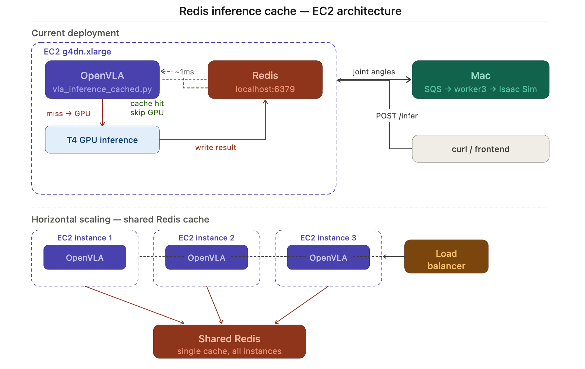
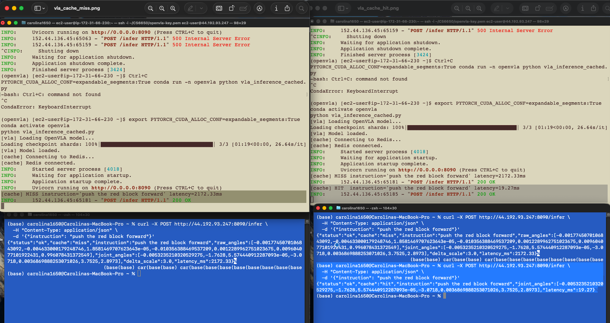

# VLA Inference Caching

Optimization: instruction-level caching for OpenVLA inference using Redis on EC2.

---

## Problem

Every call to `/infer` runs full OpenVLA inference regardless of whether the same instruction was seen before. On a T4 GPU, this costs ~1000–2300ms per request. In a demo or repeated-command scenario, this latency is unnecessary.

---

## Solution

Cache inference results in Redis, keyed by the language instruction. On a cache hit, joint angles are returned immediately from Redis without touching the GPU.

```
Instruction → Redis lookup
    ├── HIT  → return cached joint angles (~5ms)
    └── MISS → run OpenVLA inference → write to Redis → return joint angles (~1000–2300ms)
```

See architecture diagram: `vla_inference_cache_diagram.png`

---

## Implementation

**Service:** `vla_inference_cached.py` (replaces `vla_inference.py` on EC2)

**Cache key:** instruction string (lowercased, stripped)

**Cache value:** JSON-serialized joint angles list

**TTL:** none (instructions are deterministic — same instruction always maps to same output given the same model weights)

**Redis:** running locally on EC2 (`localhost:6379`)

---

## Architecture

**Before vs. after — cache hit/miss flow:**


**EC2 cache placement and horizontal scaling(future optimization):**



In a horizontally scaled deployment, all OpenVLA instances share a single Redis node. When instance 1 runs inference for "push the red block forward" and writes the result to Redis, instance 2 handling the same instruction on the next request gets a cache hit — skipping GPU inference entirely. Without a shared cache, each instance would independently run the same expensive GPU computation, wasting resources and increasing latency unnecessarily.

---

## Why Redis on EC2 (not Mac)

Running Redis on the same EC2 instance as the inference service is a deliberate architectural choice:

**Latency:** A cache lookup that crosses a network boundary (EC2 → Mac → EC2) adds ~20–50ms of round-trip overhead — partially negating the benefit of caching. With Redis on EC2, a cache hit is a localhost call (~0.1–1ms).

**Colocation principle:** The cache lives next to the compute it serves. This is standard practice in distributed systems — cache and service share a failure domain, so a network partition between machines cannot cause cache unavailability while inference is still running.

**Horizontal scalability:** If the inference service were scaled to multiple EC2 instances (e.g. behind a load balancer), a shared Redis on EC2 (or a dedicated Redis node) means all instances share the same cache. Running Redis on a developer's laptop would make the cache instance-local and break cache sharing across replicas.

**Separation of concerns:** The Mac handles Spring Boot services, Redis pub/sub, and the frontend. The EC2 handles GPU inference and inference-layer caching. Each machine owns its layer — no cross-machine state dependencies for the inference path.

---

## Redis Setup on EC2 (run once)

Amazon Linux 2023 does not have Redis in the default yum repo. Install via conda:

```bash
conda activate openvla
pip install redis
conda install -c conda-forge redis-server -y
```

Start the server:
```bash
redis-server --daemonize yes
redis-cli ping   # should return PONG
```

Note: a memory overcommit warning may appear — it is harmless for this use case.

---

## Deploy

```bash
# From Mac — copy script to EC2
scp -i ~/CS6650/openvla-key.pem \
  ~/CS6650/CS6650_Final_Project/vla/vla_inference_cached.py \
  ec2-user@<public-ip>:~/vla_inference_cached.py
```

```bash
# On EC2
conda activate openvla
python vla_inference_cached.py
```

---

## Test

**First request (cache miss):**
```bash
curl -X POST http://<ec2-public-ip>:8090/infer \
  -H "Content-Type: application/json" \
  -d '{"instruction": "push the red block forward"}'
```

**Second request (cache hit):**
```bash
curl -X POST http://<ec2-public-ip>:8090/infer \
  -H "Content-Type: application/json" \
  -d '{"instruction": "push the red block forward"}'
```

The response includes a `cache` field: `"hit"` or `"miss"`, and `latency_ms` for comparison.

---

## Results

**Cache miss** occurs on the first request for a given instruction — Redis has no stored result, so the full inference pipeline runs: camera frame capture → OpenVLA GPU inference → joint angle computation. This is the expensive path.

**Cache hit** occurs on any subsequent request with the same instruction — Redis returns the previously computed joint angles instantly, bypassing the GPU entirely. This is the fast path.

In a demo or real-time robot control scenario, the same 2–3 instructions are sent repeatedly (e.g. "push the red block forward"). After the first request warms the cache, all subsequent identical instructions are served from Redis at near-zero cost. This is the core motivation for the optimization.

| Request | Cache status | Latency |
|---|---|---|
| First (cold) | MISS | 2172.33ms |
| Second+ (warm) | HIT | 19.27ms |
| Improvement | — | ~99.1% |

A 99.1% latency reduction on repeated instructions demonstrates that instruction-level caching is highly effective for this workload. The remaining ~19ms on cache hits reflects Redis lookup + SQS publish time, not GPU inference.

*Screenshot:*



---

## Tradeoffs

**Benefit:** Near-zero latency for repeated instructions — critical for demo reliability and real-time robot control.

**Limitation:** Cache returns the same joint angles regardless of the current camera frame. If the scene changes between requests with the same instruction, the cached output may be stale. Acceptable for a fixed demo scene; not suitable for a fully dynamic environment.

**Distributed systems relevance:** Redis as a shared cache would allow multiple VLA inference instances to share results — supporting horizontal scaling without redundant GPU compute.
